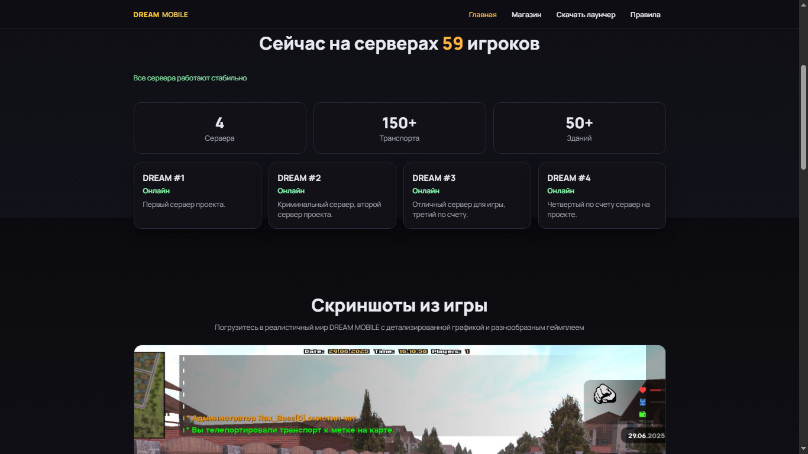
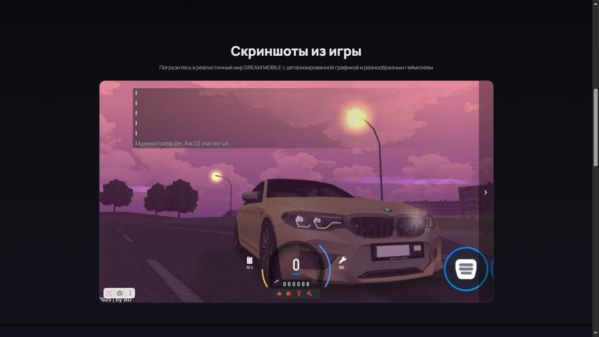
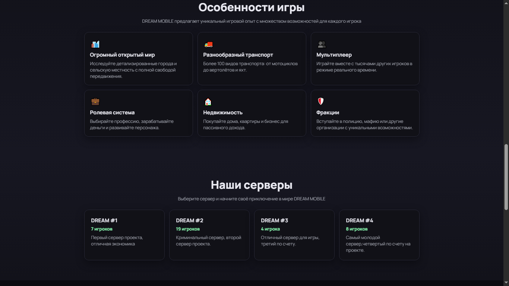

# Шаблон сайта для КРМП

Красивый, адаптивный и простой в использовании шаблон сайта в стиле КРМП (CRMP).  
Идеально подходит для создания лендинга или информационного портала, связанного с вашим КРМП-проектом.

---

## 📸 Скриншоты

Ниже несколько скриншотов шаблона в работе:

  
  

  
  

---

## ⚙️ Особенности

- Чистый и понятный дизайн, вдохновлённый стилем КРМП.
- Адаптивность для всех устройств (мобильные, планшеты, ПК).
- Быстрая и лёгкая настройка под ваш проект.
- Готовые компоненты для отображения новостей, информации о сервере, донат-системы и прочего.
- Использование современных стандартов HTML5 и CSS3.

---

